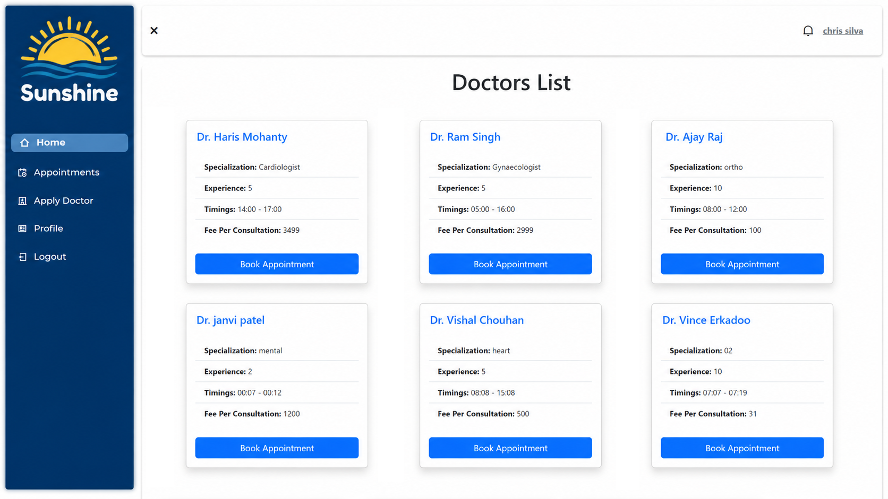

# Sunshine Health - Doctor Appointment Booking App

Welcome to Sunshine Health! This is a Doctor Appointment Booking App designed to streamline the process of scheduling appointments with healthcare professionals. With MongoDB for flexible data handling, React and Ant Design for dynamic UI components, and Node.js with Express for a scalable server, Sunshine Health offers a robust solution for both users and administrators.



## Features

- **Appointment Booking**: Users can easily schedule appointments with healthcare professionals through the webiste.
- **Flexible Data Handling**: MongoDB is used to efficiently manage and store data, providing flexibility and scalability.
- **Dynamic UI Components**: React and Ant Design are utilized to create a dynamic and user-friendly interface for seamless navigation.
- **Scalable Server**: Node.js with Express ensures a scalable and efficient server-side architecture.
- **Intuitive Admin Panel**: Administrators have access to an intuitive admin panel for easy management of appointments and users.
- **Real-Time Notifications**: The app incorporates a notification system to provide users with real-time updates regarding their appointments.


## Installation

### Backend

1. Clone the repository

   ```bash
   git clone https://github.com/your-username/Sunshine-Health.git
   cd Sunshine-Health
   
2. Navigate to the server directory
   ```bash
   cd server
   
3. Install backend dependencies
   ```bash
   npm install

4. Create a .env file in the server directory and add the following environment variables
   ```bash
   PORT=8080
   MONGO_URL=your_mongodb_connection_string
   JWT_SECRET=your_jwt_secret
   NODE_ENV=development
   DEV_MODE=development
   FRONTEND_URL=http://localhost:3000

5. Start the backend server
   ```bash
   nodemon || node app.js

### Frontend

1. Navigate to the client directory

   ```bash
   cd ../client
2. Install frontend dependencies

   ```bash
   npm install

3. Create a .env file in the client directory and add the following

   ```bash
   REACT_APP_BASE_URL=http://localhost:8080/api/v1
   
4. Start the frontend development server

   ```bash
   npm start


## Contributing

Contributions are welcome! If you'd like to contribute to Sunshine Health, please follow these steps:

1. Fork the repository.
2. Create a new branch (`git checkout -b feature/your-feature-name`).
3. Make your changes and commit them (`git commit -m 'Add new feature'`).
4. Push to the branch (`git push origin feature/your-feature-name`).
5. Create a new Pull Request.

## License

This project is licensed under the MIT License - see the [LICENSE](LICENSE) file for details.

## Acknowledgements

- [MongoDB](https://www.mongodb.com/)
- [React](https://reactjs.org/)
- [Ant Design](https://ant.design/)
- [Node.js](https://nodejs.org/)
- [Express](https://expressjs.com/)


Thank you for using Sunshine Health!
